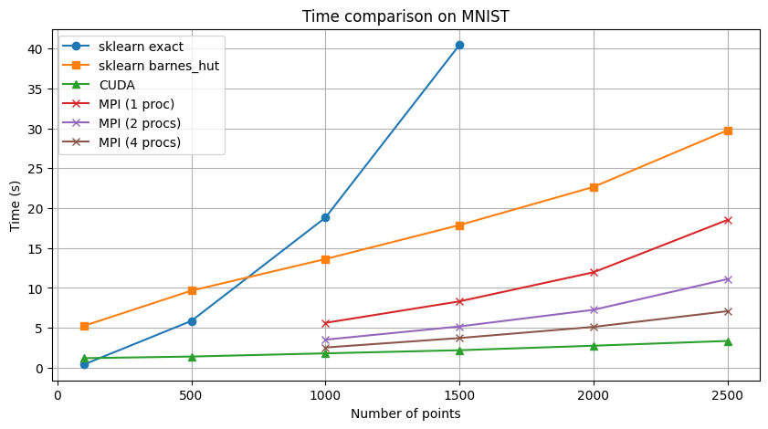

# MPI-based t-SNE

This is an MPI-based implementation of Barnes-Hut t-SNE. It is built off of the sklearn implementation of BH t-SNE using a python wrapper on MPI.

<div align="center">
  
  <a href="report.pdf">Report</a>
</div>

## Building and Running

The building instructions are the same as for original sklearn t-sne, which can be found in `README_ORIGINAL.rst`

Only difference is that you also need to install mpi before building:

```bash
conda install mpi4py openmpi
```

To run, execute a command as follows:

```bash
mpiexec -n 4 python tsne.py
```

Changing 4 to be the number of processes you would like to use.
